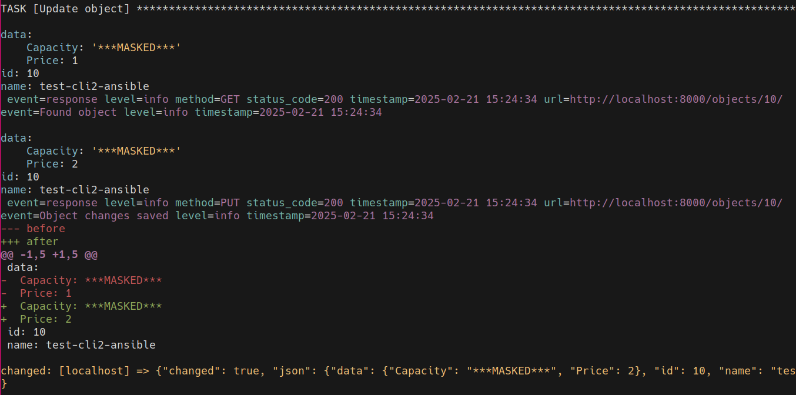
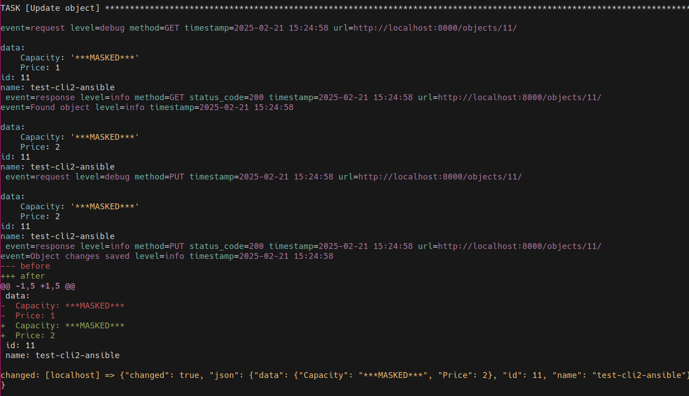

Tutorial for cli2.ansible: Ansible Action Plugin framework
~~~~~~~~~~~~~~~~~~~~~~~~~~~~~~~~~~~~~~~~~~~~~~~~~~~~~~~~~~

Experimental feature, requires ``ansible``, to build `custom action plugins
<https://docs.ansible.com/ansible/latest/dev_guide/developing_plugins.html#action-plugins>`_

Features
========

Async
-----

With :py:class:`cli2.ansible.ActionBase`, we don't define run, we define
:py:meth:`~cli2.ansible.ActionBase.run_async`

.. code-block:: python

    from cli2 import ansible

    class ActionModule(ansible.ActionBase):
        async def run_async(self):
            self.tmp        # is the usual tmp arg
            self.task_vars  # is the usual task_vars arg
            self.result['failed'] = True

Option
------

With :py:class:`cli2.ansible.Option`, we can declare task options instead of
fiddling with task_vars:

.. code-block:: python

    class ActionModule(ansible.ActionBase):
        name = ansible.Option('name', default='test')

        async def run_async(self):
            self.result['name'] = self.name

Client
------

You need to return a :py:class:`~cli2.client.Client` instance in the
:py:meth:`~cli2.ansible.ActionBase.client_factory` method to have a
``self.client`` attribute:

.. code-block:: python

    class ActionModule(ansible.ActionBase):
        name = ansible.Option('name', default='test-name')
        value = ansible.Option('value', default='test-value')

        async def client_factory(self):
            return YourClient()

        async def run_async(self):
            obj = await self.client.YourObject.find(name=self.name).first()
            # ....

And then you get absolutely beautiful logging:

- with ``-v``: log level will be set to ``INFO``, which means you will see
  responses.
- with ``-vv``: log level will be set to ``DEBUG``, which means you will see
  requests too.

There is no way to set :envvar:`DEBUG`, as we never want masked secrets to
output in an Ansible Tower job. But you can still export ``DEBUG=1`` prior to
executing Ansible manually, which will dump all pagination requests/responses
and secrets.

Without ``-v``:

With ``-v``:

With ``-vv``:

Diff
----

We're going to be changing stuff, and Ansible doesn't interpret before/after
result keys which means it won't dump a diff even with ``--diff``.

Instead of calling :py:func:`~cli2.display.diff_data` manually, you can call
:py:meth:`~cli2.ansible.ActionBase.before_set` and
:py:meth:`~cli2.ansible.ActionBase.after_set`, then a diff will be displayed
automatically.

.. code-block:: python

    class ActionModule(ansible.ActionBase):
        name = ansible.Option('name', default='test-name')
        value = ansible.Option('value', default='test-value')

        async def client_factory(self):
            return YourClient()

        async def run_async(self):
            obj = await self.client.Object.find(name=self.name).first()

            if self.task_vars['ansible_verbosity'] > 1:
                # don't display diff if not -v
                self.before_set(obj.data)

            obj.value = self.value

            if obj.changed_fields:
                response = await obj.save()
                self.result['changed'] = True

                if self.verbosity > 1:
                    self.after_set(obj.data)

                # we can also get masked data
                key, value = self.client.response_log_data(response)
                self.result[key] = value

Testing
=======

Mock
----

You can run the module in mocked mode in tests with the
:py:meth:`~cli2.ansible.ActionModule.run_test_async` method:

.. code-block:: python

    @pytest.mark.asyncio
    async def test_module():
        module = await your.ActionModule.run_test_async(
            args=dict(
                name='test',
                capacity='5',
                price='3',
            )
        )
        assert module.result['changed']

For HTTP response mocking, you should use httpx_mock from pytest-httpx, as seen
in the example below.

Subprocess
----------

You can also create playbooks on the fly and run them in a subprocess that
calls ansible-playbook in localhost, thanks to the
:py:class:`~cli2.pytest_ansible.Playbook` fixture:

.. code-block:: python

    def test_playbook_exec(playbook):
        playbook.task_add('debug', args=dict(msg='hello'))
        result = playbook()
        assert result['changed'] == 0
        assert result['ok'] == 2

The previous, mocking solution, is always preferable. But if you also want
functional tests, then this works great.

Documenting
===========

That's a bit trickier, you have to put a module plugin with a name matching
your action plugin and set the documentation in YAML strings in there.

Once your documentation outputs properly with ``ansible-doc`` command, you can
have it in your Sphinx documentation with various plugins that you'll find
easily on internet, except probably for mine which I prefer to use:
`ansible-sphinx <https://yourlabs.io/oss/ansible-sphinx>`_ which currently
lacks documentation although it does contain a test repo with all the examples
you need.

Example
=======

Plugin
------

This uses the example cli2 Client that we developed in :ref:`the cli2.client
example<Example Client>`:

.. literalinclude:: ../tests/yourlabs/test/plugins/action/restful_api.py

Tests
-----

.. literalinclude:: ../cli2/test_restful.py

API
===

.. automodule:: cli2.ansible
   :members:

.. automodule:: cli2.pytest_ansible
   :members:
