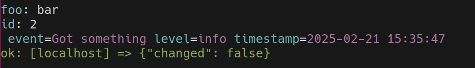

Ansible
~~~~~~~

Ansible Action Plugin micro framework
=====================================

Requires ``ansible``, to build `custom action plugins
<https://docs.ansible.com/ansible/latest/dev_guide/developing_plugins.html#action-plugins>`_

Action plugins are generally preferable to Module plugins:

- they execute on the Ansible controller
- which is faster
- they can still call any module on the target host
- they can stream output (logs) in real-time

Useful on its own, it also integrates very well with the rest of our stuff:

- :doc:`display`
- :doc:`log`
- :doc:`client`
- :doc:`lock`

Example Plugin
--------------

This uses the example cli2 Client that we developed in :ref:`the cli2.client
example<Example Client>`:

.. literalinclude:: ../tests/yourlabs/test/plugins/action/restful_api.py

Async
-----

With :py:class:`~cli2.ansible.action.ActionBase`, we don't define run, we define
:py:meth:`~cli2.ansible.action.ActionBase.run_async`

.. code-block:: python

    import cli2
    from cli2 import ansible

    class ActionModule(ansible.ActionBase):
        async def run_async(self):
            self.tmp        # is the usual tmp arg
            self.task_vars  # is the usual task_vars arg
            cli2.log.debug('Getting something')
            self.result['failed'] = True
            cli2.log.info('Got something', json=something)

And then you get absolutely beautiful logging:

- ``json`` logger key is configured to render as colored yaml
- with ``-v``: log level will be set to ``INFO``, which you should you use to
  indicate that something **has been done**
- with ``-vv``: log level will be set to ``DEBUG``, which you should you use to
  indicate that something **is going to be attempted**

Without ``-v``:


With ``-v``:



With ``-vv``:


Option
------

With :py:class:`~cli2.ansible.action.Option`, we can declare task options
instead of fiddling with task_vars:

.. code-block:: python

    class ActionModule(ansible.ActionBase):
        # an option with a default
        name = ansible.Option(arg='name', default='test')

        # an option without default: if not specified, the module will fail and
        # request that the user configures a value for this option
        nodefault = ansible.Option('nodefault')

        # option that takes value from a fact
        global_option = ansible.Option(fact='your_fact')

        # an option that takes value from a task arg if available, otherwise
        # from a fact, otherwise default
        region = ansible.Option(arg='region', fact='region', default='EU')

        async def run_async(self):
            self.result['name'] = self.name
            self.result['region'] = self.region
            # ...

An option can specify an argument name, and/or a global fact name, and a
default.

Client
------

You need to return a :py:class:`~cli2.client.Client` instance in the
:py:meth:`~cli2.ansible.action.ActionBase.client_factory` method to have a
``self.client`` attribute:

.. code-block:: python

    class ActionModule(ansible.ActionBase):
        name = ansible.Option('name', default='test-name')
        value = ansible.Option('value', default='test-value')

        async def client_factory(self):
            return YourClient()

        async def run_async(self):
            obj = await self.client.YourObject.find(name=self.name).first()
            # ....

And then you get absolutely beautiful logging:

- with ``-v``: log level will be set to ``INFO``, which means you will see
  responses.
- with ``-vv``: log level will be set to ``DEBUG``, which means you will see
  requests too.

There is no way to set :envvar:`DEBUG` from ansible, as we never want masked
secrets to output in an Ansible Tower job. But you can still export ``DEBUG=1``
prior to executing Ansible manually, which will dump all pagination
requests/responses and secrets.

Without ``-v``:

.. image:: ansible_noverbose.png

With ``-v``:

.. image:: ansible_v.png

With ``-vv``:

.. image:: ansible_vv.png

Diff
----

We're going to be changing stuff, and Ansible doesn't interpret before/after
result keys which means it won't dump a diff even with ``--diff``.

Instead of calling :py:func:`~cli2.display.diff_data` manually, you can call
:py:meth:`~cli2.ansible.action.ActionBase.before_set` and
:py:meth:`~cli2.ansible.action.ActionBase.after_set`, then a diff will be displayed
automatically.

.. code-block:: python

    class ActionModule(ansible.ActionBase):
        name = ansible.Option('name', default='test-name')
        value = ansible.Option('value', default='test-value')

        async def client_factory(self):
            return YourClient()

        async def run_async(self):
            obj = await self.client.Object.find(name=self.name).first()

            if self.verbosity:
                # don't display diff if not -v
                self.before_set(obj.data)

            obj.value = self.value

            if obj.changed_fields:
                response = await obj.save()
                self.result['changed'] = True

                if self.verbosity:
                    self.after_set(obj.data)

                # we can also get masked data
                key, value = self.client.response_log_data(response)
                self.result[key] = value

Also, I note that I always forget to pass ``--diff`` anyway, so do my users,
I'm assuming the user is trying to understand what's going on as soon as they
pass a single ``-v``, so, this example will only check if any verbosity is
activated at all to display the diff.

If you really want the diff to display only with ``--diff``, then wrap your
before_set/after_set in ``if self.task_vars['ansible_diff_mode']`` instead of
``if self.verbosity``.

Secret masking
--------------


Until we get `Data Tagging <https://github.com/ansible/ansible/issues/80747>`_,
this class provides several secret masking mechanisms, which are not only able
to mask values corresponding on keys to mask, but also to learn values to mask
in longer strings:

- Class :py:attr:`~cli2.ansible.action.ActionBase.mask` attribute: list of keys
  to mask, hardcoded by yourself in your ActionModule.
- Keys can also be set from the playbook in the ``mask`` ansible fact.
- Keys from the :py:attr:`~cli2.ansible.action.ActionBase.client`'s
  :py:attr:`~cli2.client.Client.mask`, if any
- All of these are combined together in the
  :py:attr:`~cli2.ansible.action.ActionBase.masked_keys` read-only property.

The first thing the plugin does, is collecting values to mask from task args
and ansible facts to provision
the internal :py:attr:`~cli2.ansible.action.ActionBase.masked_values` list.

Masking is done in the :py:meth:`~cli2.ansible.action.ActionBase.mask_data()`
method which you can use to apply masking in any kind of data:

- when it finds a dict key that is in
  :py:attr:`~cli2.ansible.action.ActionBase.masked_keys`: replace that with
  ``***MASKED***```, also, append the value to
  :py:attr:`~cli2.ansible.action.ActionBase.masked_values`
- when it finds a string, it will replace all
  :py:attr:`~cli2.ansible.action.ActionBase.masked_values` with
  ``***MASKED***``.

As such, :py:meth:`~cli2.ansible.action.ActionBase.mask_data()` does both
masking **and** learning values to mask.

When this feature is used then you can use ``no_log: true`` and still
This allows to use ``no_log: true`` and still have an output of the result.

Setting a module level mask:

.. code-block:: python

    class ActionModule(ansible.ActionBase):
        mask = ['password']

Marking a variable value as masked:

.. code-block:: yaml

    - set_fact:
        mask:
        - your_password

Will cause any occurence of the values of any ``password`` or ``your_password``
to be replaced with ``***MASKED***`` by
:py:meth:`~cli2.ansible.action.ActionBase.mask_data()`.

Note that :py:meth:`~cli2.ansible.action.ActionBase.mask_data()` is also called
by :py:meth:`~cli2.ansible.action.ActionBase.print_yaml()` so that you can dump
any dict safely in there.

We're not shipping a collection, so it's complicated to ship modules from a pip
package, but you can make a shell module that will use masking:

.. code-block:: python

    class ActionModule(ansible.ActionBase):
        cmd = ansible.Option('cmd')

        async def run_async(self):
            self.result.update(self.subprocess_remote(self.cmd))

Where :py:meth:`~cli2.ansible.action.ActionBase.subprocess_remote()` is a basic
helper function we provide to run commands over the target host, with fully
supported masking.

Testing
-------

You can run the module in mocked mode in tests with the
:py:meth:`~cli2.ansible.action.ActionBase.run_test_async` method:

.. code-block:: python

    @pytest.mark.asyncio
    async def test_module():
        module = await your.ActionModule.run_test_async(
            args=dict(
                name='test',
                capacity='5',
                price='3',
            )
        )
        assert module.result['changed']

For HTTP response mocking, you should use httpx_mock from pytest-httpx, as seen
in the example below:

.. literalinclude:: ../tests/test_restful.py

Variables reader
================

.. automodule:: cli2.ansible.variables
   :members:

Playbook generator
==================

.. danger:: Requires ``pip install pytest-cli2-ansible`` to register the pytest
            plugin.

You can also create playbooks on the fly and run them in a subprocess that
calls ansible-playbook in localhost, thanks to the
:py:class:`~cli2.pytest_ansible.Playbook` fixture:

.. code-block:: python

    def test_playbook_exec(playbook):
        playbook.task_add('debug', args=dict(msg='hello'))
        result = playbook()
        assert result['changed'] == 0
        assert result['ok'] == 2

The previous, mocking solution, is always preferable when possible, because it
doesn't depend on the network to succeed. But if your action plugin is more
complicated than that then this works great.

While the internal Python API of Ansible would also work, this uses Ansible
public API which is less subject to change, and emulates exactly what a user
would do with your plugin.

Documenting
===========

That's a bit trickier, you have to put a module plugin with a name matching
your action plugin and set the documentation in YAML strings in there.

Once your documentation outputs properly with ``ansible-doc`` command, you can
have it in your Sphinx documentation with various plugins that you'll find
easily on internet, except probably for mine:
`ansible-sphinx <https://yourlabs.io/oss/ansible-sphinx>`_.

API
===

.. automodule:: cli2.ansible.action
   :members:

.. automodule:: cli2.ansible.playbook
   :members:
