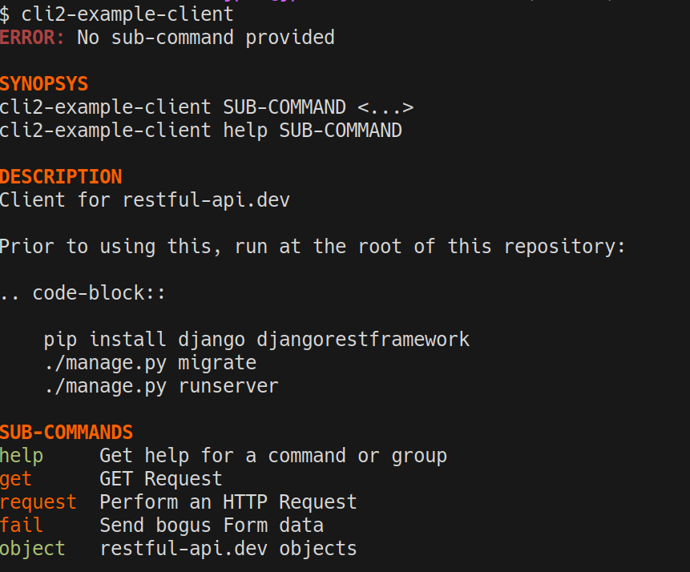
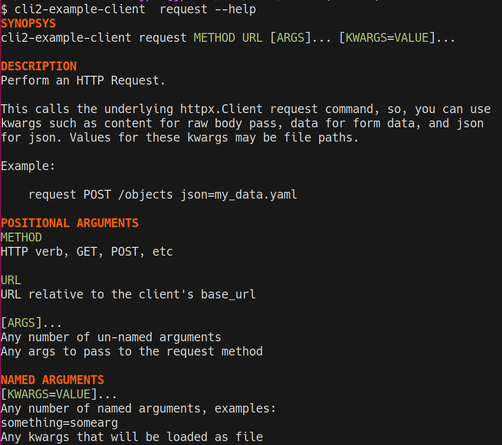
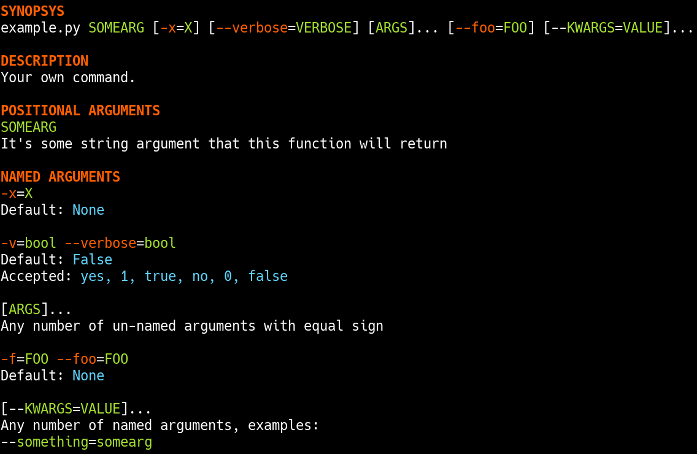
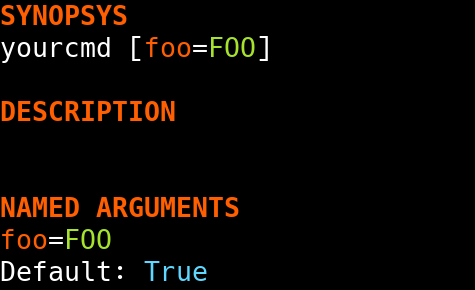
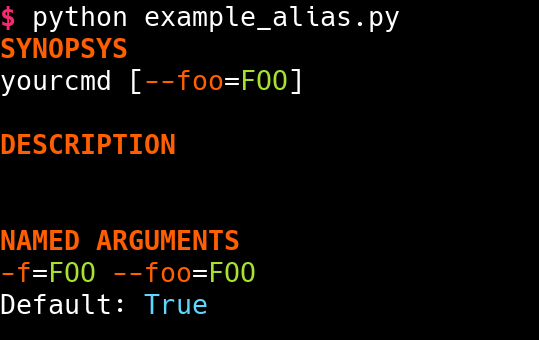

CLI framework
~~~~~~~~~~~~~

Architecture
============

Overview
--------

cli2 is built on 3 moving parts which you can swap with your own or inherit
from with ease:

- :py:class:`~cli2.cli.Command`: Represents a target callback, in charge
  of CLI args parsing and execution, can serve as entry point.
- :py:class:`~cli2.cli.Group`: Same as above, except that it routes multiple
  Commands, can serve as entry point as well.
- :py:class:`~cli2.cli.Argument`: Represents a target callback argument,
  in charge of deciding if it wants to take an argument as well as casting it
  into a Python value.

All outputs are fed into :py:func:`~cli2.display.print`, meaning the outputs
are colored too. Any kind of output will work: normal return, generator, async
coroutine, async generator.

Tutorial
========

Functions
---------

In general, you want to create a command :py:class:`~cli2.cli.Group`:

.. code-block:: python

    """
    Welcome to your CLI
    """
    import cli2

    cli =  cli2.Group(doc=__doc__)

    @cli.cmd
    def yourcmd(somearg: str):
        """
        Your own command.

        :param somearg: It's some string argument that this function will return
        """
        return somearg

    if __name__ == '__main__':
        cli.entry_point()

Entrypoint
----------

You can also add this command to console_scripts in setup.py:

.. code-block:: python

    setup(
        # ...
        entry_points={
            'console_scripts': [
                'your-cli-name = your_cli:cli.entry_point',
        },
    )

Classes and objects
-------------------

:py:meth:`~cli2.cli.Group.load` will load all methods if they have been
decorated with ``@cmd``:

.. code-block:: python

    class YourStuff:
        @classmethod
        @cli2.cmd
        def factory(cls):
            return cls()

        @cli2.cmd(color='green')
        def instance_method(self, arg):
            return arg

    cli = cli2.Group()
    cli.load(YourStuff)
    # you'll leverage the factory override to hide an argument from the CLI and
    # instead provide a callable (they can be async too)
    cli.overrides['self']['factory'] = lambda: YourStuff()
    cli.overrides['cls']['factory'] = lambda: YourStuff

Example
-------

The command group will look a bit like this:

The command itself like that:

``_cli2``
---------

If you need to know if a function is executed from cli2, you can add a
``_cli2`` special keyword argument:

.. code-block:: python

    def your_cmd(*args, _cli2=None):
        if _cli2:
            print('in cli2')
            if not args:
                return _cli2.help(error='Send me some args please!')
        else:
            return some

``_cli2`` will be the :py:class:`~cli2.cli.Command` instance if detected in
function signature.

Posix style
-----------

You might prefer to have dashes in front of argument names in the typical style
of command lines, you just need to enable the posix attribute:

.. code-block:: python

    cli2.cli(yourcmd, posix=True).entry_point()

In this case, help will look like this:

.. warning:: I still don't use the POSIX mode, it's far from perfect, but I'll
             gladly try to fix bugs!

Testing
=======

Direct calls
------------

The :py:meth:`~cli2.cli.Command.parse` method will provision the
:py:attr:`~cli2.cli.Command.bound` attribute which is a Python 3
BoundArguments instance, so you could test parsing as such:

.. code-block:: python

    cmd = cli2.cli(yourcmd)
    cmd.parse('a', 'b', 'c=d')
    assert cmd.bound.arguments == dict(somearg='a', x='b', kwargs={'c': 'd'})

Same if you want to use the posix style:

.. code-block:: python

    cmd = cli2.cli(yourcmd, posix=True)
    cmd.parse('a', 'b', '--c=d')
    assert cmd.bound.arguments == dict(somearg='a', x='b', kwargs={'c': 'd'})

autotest
--------

.. automodule:: cli2.test
   :members:

Argument
========

Factory
-------

You may want some arguments to have automatically computed values instead of
being exposed to the user CLI. This is what argument factories are for:

.. code-block:: python

    class Foo:
        @cli2.arg('auto', factory=lambda: 'autoval')
        @cli2.arg('self', factory=lambda cmd, arg: Foo())
        def test(self, auto, arg):
            return auto, arg

    cli2.cli(Foo.test)

This command will only expose the `arg` argument to the user.  Both self and
auto will have the result of the lambda passed as factory.

If the factory callback takes an `arg` argument, then the
:py:class:`~cli2.cli.Argument` object will be passed.

If the factory callback takes an `cmd` argument, then the
:py:class:`~cli2.cli.Command` object will be passed.

Aliases
-------

By default, named arguments are given aliases (CLI argument names) generated
from their Python argument names. For example:

.. code-block:: python

    def yourcmd(foo=True):
        print(foo)
    cmd = cli2.cli(yourcmd)
    cmd.help()

Will render help as such:

Posix
-----

If posix mode is enabled, then a couple of dashes will prefix the Python
argument name, and another one-letter-long alias with a single dash will be
generated.

Overrides
---------

You may overrides :py:class:`~cli2.cli.Argument` attributes for a callable
argument with the :py:func:`~cli2.decorators.arg` decorator:

.. code-block:: python

    @cli2.arg('foo', alias='bar')
    def yourcmd(foo):
        pass

This also takes a list of aliases:

.. code-block:: python

    @cli2.arg('foo', alias=['foo', 'f', 'foooo'])
    def yourcmd(foo):
        pass

This decorator basically sets ``yourcmd.cli2_foo`` to a dict with the alias
key.

Hide
----

You can also hide an argument from CLI:

.. code-block:: python

    import cli2

    @cli2.hide('foo', 'bar')
    def yourcmd(a, foo=None, bar=None):
        pass

Integers
--------

Type hinting is well supported, the following example enforces conversion of an
integer argument:

.. code-block:: python

    def yourcmd(i : int):
        pass

    cmd = cli2.cli(yourcmd)
    cmd.parse('1')
    assert cmd.bound.arguments == dict(i=1)

Boolean
-------

Declare a boolean type hint for an argument as such:

.. code-block:: python

    def yourcmd(yourbool : bool):

You won't have to specify the value of a boolean argument, but if you want to
then:

- for ``False``: no, 0, false
- for ``True``: yes, 1, true, anything else

Values don't need to be specified, which means that you don't have to type
``yourbool=true``, just ``yourbool`` or ``--yourbool`` in POSIX mode will set
it to True.

Since the mere presence of argument aliases suffice to bind a parameter to
True, an equivalent is also possible to bind it to False:
:py:attr:`~cli2.cli.Argument.negate`. It is by default generated by
prefixing ``no-`` to the argument name, as such, passing ``no-yourbool`` on the
command line will bind ``yourbool`` to ``False``, or in posix mode by passing
``--no-yourbool``. Note that a single-dash two-letter negate is also generated
in posix mode, so ``-ny`` would also work to bind ``yourbool`` to ``False``.

False
-----

While the negates are set by default on boolean arguments, you may also set it
on non-boolean arguments, just like you could override it like you would
override aliases:

.. code-block:: python

    @cli2.arg('yourbool', negate='--no-bool')
    def yourcmd(yourbool):

List and Dicts
--------------

Arguments annotated as list or dict will have CLI values automatically casted
to Python using JSON.

.. code-block:: python

    def yourcmd(foo: list):
        print(foo)

But be careful with spaces on your
command line: one sysarg goes to one argument::

    yourcmd ["a","b"]   # works
    yourcmd ["a", "b"]  # does not because of the space

However, space is supported as long as in the same sysarg:

.. code-block:: python

    subprocess.check_call(['yourcmd', '["a", "b"]')

Typable lists and dicts
-----------------------

So, the above will work great when called by another program, but not really
nice to type. So, another syntax for the purpose of typing is available and
works as follow.

Arguments with the list type annotation are automatically parsed as JSON, if
that fails it will try to split by commas which is easier to type than JSON for
lists of strings::

    yourcmd a,b  # calls yourcmd(["a", "b"])

Keep in mind that JSON is tried first for list arguments, so a list of ints is
also easy::

    yourcmd [1,2]  # calls yourcmd([1, 2])

A simple syntax is also supported for dicts by default::

    yourcmd a:b,c:d  # calls yourcmd({"a": "b", "c": "d"})

The disadvantage is that JSON decode exceptions are swallowed, but by design
cli2 is supposed to make Python types more accessible on the CLI, rather than
being a JSON validation tool. Generated JSON args should always work though.

Custom type casting
-------------------

You may also hack how arguments are casted into python values at a per argument
level, using decorator syntax or the lower level Python API.

For example, you can override the :py:meth:`~cli2.cli.Argument.cast()`
method for a given argument as such:

.. code-block:: python

    @cli2.args('ages', cast=lambda v: [int(i) for i in v.split(',')])
    def yourcmd(ages):
        return ages

    cmd = Command(yourcmd)
    cmd(['1,2']) == [1, 2]  # same as CLI: yourcmd 1,2

You can also easily write an automated test:

.. code-block:: python

    cmd = cli2.cli(yourcmd)
    cmd.parse('1,2')
    assert cmd.bound.arguments == dict(ages=[1, 2])

Overridding default code
========================

Argument overriding
-------------------

Overriding an Argument class can be useful if you want to heavily customize an
argument, here's an example with the age argument again:

.. code-block:: python

    class AgesArgument(cli2.cli):
        def cast(self, value):
            # logic to convert the ages argument from the command line to
            # python goes in this method
            return [int(i) for i in value.split(',')]

    @cli2.arg('ages', cls=AgesArgument)
    def yourcmd(ages):
        return ages

    assert yourcmd('1,2') == [1, 2]

Command class overriding
------------------------

Overriding the Command class can be useful to override how the target callable
will be invoked.

Example:

.. code-block:: python

    class YourThingCommand(cli2.cli):
        def call(self, *args, **kwargs):
            # do something
            return self.target(*args, **kwargs)

    @cli2.cmd(cls=YourThingCommand)
    def yourthing():
        pass

    cmd = cli2.cli(yourthing)  # will be a YourThingCommand

You may also override at the group level, basically instanciate your
:py:class:`~cli2.cli.Group`: with the ``cmdclass`` argument:

.. code-block:: python

    cli = cli2.cli(cmdclass=YourThingCommand)
    cli.add(your_function)

.. _cli-only-arguments:

CLI only arguments
------------------

A more useful example combining all the above, suppose you have two functions
that take a "schema" argument that is a python object of a "Schema" class of
your own.

.. code-block:: python

    class Schema(dict):
        def __init__(self, filename, syntax):
            """ parse file with given syntax ..."""

    @cli.cmd
    def build(schema):
        """ build schema """

    @cli.cmd
    def manifest(schema):
        """ show schema """

In this case, overriding the schema argument with custom casting won't work
because the schema argument is built with two arguments: filename in syntax!

Solution:

.. code-block:: python

    class YourCommand(cli2.cli):
        def setargs(self):
            super().setargs()

            # hide the schema argument from CLI
            del self['schema']

            # create two arguments programatically
            self.arg(
                'filename',
                position=0,
                kind='POSITIONAL_ONLY',
                doc='File to use',
            )
            self.arg(
                'syntax',
                kind='KEYWORD_ONLY',
                doc='Syntax to use',
            )

        def call(self, *args, **kwargs):
            schema = Schema(
                self['filename'].value,
                self['syntax'].value,
            )
            return self.target(schema, *args, **kwargs)

    @cli.cmd
    def build(schema):
        """ build schema """

    @cli.cmd
    def manifest(schema):
        """ show schema """

There you go, you can automate command setup like with the creation of a schema
argument and manipulate arguments programatically!

Check `cli2/test_inject.py` for edge cases and more fun examples!

.. literalinclude:: ../cli2/test_inject.py
   :language: python

Edge cases
==========

Simple and common use cases were favored over rarer use cases by design. Know
the couple of gotchas and you'll be fine.

Args containing ``=`` when ``**kwargs`` is present
--------------------------------------------------

Simple use cases are favored over rarer ones when a callable has varkwargs.

When a callable has ``**kwargs`` as such:

.. code-block:: python

    def foo(x, **kwargs):
        pass

Then, arguments that look like kwargs will be attracted to the kwargs
argument, so if you want to call ``foo("a=b")`` then you need to call as such::

    foo x=a=b

Because the following will call ``foo(a='b')``, and fail because of missing
``x``, which is more often than not what you want on the command line::

    foo a=b

Now, even more of an edgy case when ``*args, **kwargs`` are used:

.. code-block:: python

    def foo(*args, **kwargs):
        return (args, kwargs)

Call ``foo("a", b="x")`` on the CLI as such::

    foo a b=x

**BUT**, to call ``foo("a", "b=x")`` on the CLI you will need to use an
asterisk with a JSON list as such::

    foo '*["a","b=x"]'

Admittedly, the second use case should be pretty rare compared to the first
one, so that's why the first one is favored.

For the sake of consistency, varkwarg can also be specified with a double
asterisk and a JSON dict as such::

    # call foo("a", b="x")
    foo a **{"b":"x"}

Calling with ``a="b=x"`` in ``(a=None, b=None)``
------------------------------------------------

The main weakness is that it's difficult to tell the difference between a
keyword argument, and a keyword argument passed positionnaly which value starts
with the name of another keyword argument. Example:

.. code-block:: python

    def foo(a=None, b=None):
        return (a, b)

Call ``foo(b='x')`` on the CLI like this::

    foo b=x

**BUT**, to call ``foo(a="b=x")`` on the CLI, you need to name the argument::

    foo a=b=x

Admitadly, that's a silly edge case. Protect yourself from it by always naming
keyword arguments ...

... Because the parser considers token that start with a keyword of a keyword
argument prioritary to positional arguments once the positional arguments have
all been bound.

API
===

.. automodule:: cli2.cli
   :members:
