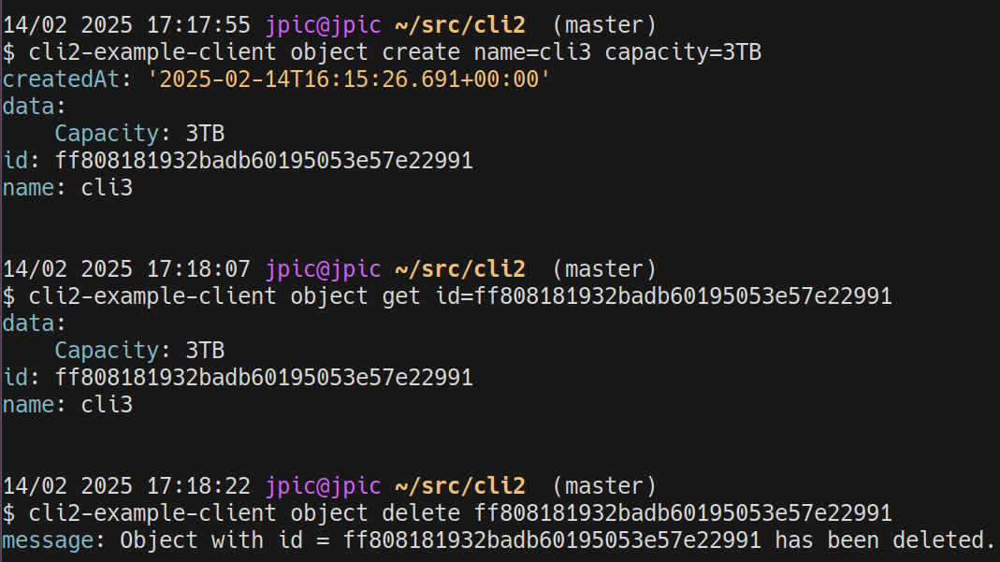
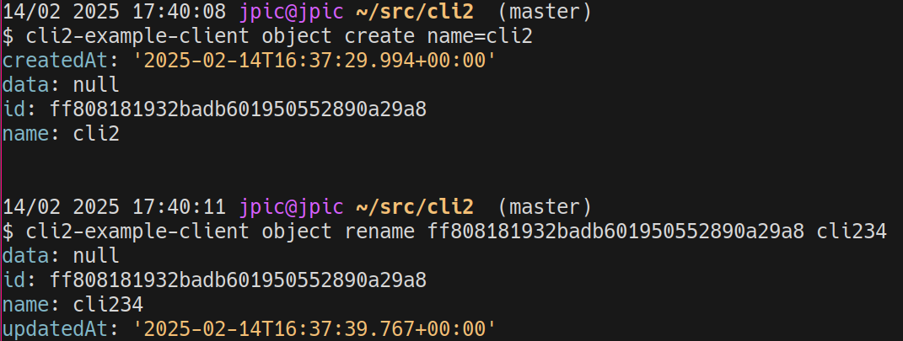
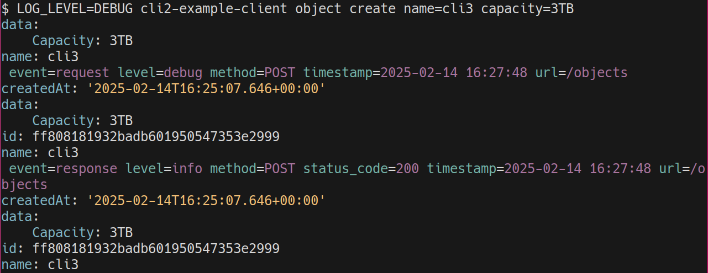

Tutorial for cli2.Client: HTTP Client framework
~~~~~~~~~~~~~~~~~~~~~~~~~~~~~~~~~~~~~~~~~~~~~~~

Experimental feature, to enjoy it fully, install cli2 with ``client`` as such::

    pip install cli2[client]

The goal of cli2.client module is to provide a generic framework to
build HTTP client libs and CLIs onto, after carrying this pattern from a
project to another, I've refactored this stuff here:

- great logging: Sent/Received JSON output is dumped as YAML, colored in
  console, and not-colored to file
- ``export LOG_LEVEL=DEBUG`` to enable debug output
- debug output always saved in ``~/.local/cli2/log``, **they will eventually fill
  up your drive and I've not yet decided a solution against that**, but I just
  love this feature,
- absolutely beautiful HTTP Exceptions
- ``export HTTP_DEBUG=1`` for low-level HTTP Debugging output
- **a ORM for REST resources**

Example
=======

And of course all this is designed to combine very well with CLIs, because once
you have a library for an API, which you're going to embed in god knows what
(your API server, an Ansible plugin ...), you'll want to work with a CLI to
debug stuff: discover the API and implement features incrementally.

Source code
-----------

.. literalinclude:: ../cli2/example_client.py

Mind you, the Object can be used in a Django-ish ORM style and all these CLIs
were created with free Sphinx documentation as seen in :ref:`Example CLI`.

Outputs are just beautiful of course:



See a builtin command with a custom command in action:



The debug output is also awesome:



It shows:

- the JSON being sent to the server
- request/method/url/timestamp
- the JSON being returned by the server
- response status code returned by the server
- finnaly, the return value of the command, which is the created object, see
  how the returned object was updated with the id and createAt fields which
  came from the response

Of course, you're going to be able to override/customize everything as you dig
into the API that you're implementing a client for.

Architecture
============

The client module is built around 3 main moving parts:

- :py:class:`~cli2.client.Client`: A wrapper around the ``httpx.AsyncClient``
  class,
- :py:class:`~cli2.client.Handler`: Used by the client to automate response
  handling: do we retry, need to re-create a TCP Session, or get a new token...
- :py:class:`~cli2.client.Model`: A Django-like model metaclass, that comes
  with it's :py:class:`~cli2.client.Field` classes and their expressions_

Tutorial
========

Creating a Client
-----------------

Start by extending a :py:class:`~cli2.client.Client`:

.. code-block:: python

    import cli2

    class YourClient(cli2.Client):
        pass

    # you get a CLI for free
    cli = YourClient.cli

There are a few methods that you might want to override:

- :py:meth:`~cli2.client.Client.client_factory`: where you can customize the
  actual httpx AsyncClient instance before it is used by cli2 Client.
- :py:meth:`~cli2.client.Client.token_get`: if you want your client to do some
  authentication dance to get a token

Pagination
----------

The default :py:class:`~cli2.client.Paginator` is pretty dump, it just
increments a ``page`` GET parameter until it gets an empty results list.

It's sub-optimal, for the paginator to know when to stop, it needs to know the
total pages, implement that in
:py:meth:`~cli2.client.Paginator.pagination_initialize`:

.. code-block:: python

    class YourPaginator(cli2.Paginator):
        def pagination_initialize(self, data):
            self.total_pages = data['total_pages']

    class YourClient(cli2.Client):
        paginator = YourPaginator

Perhaps you don't get the total pages from the API response, but you do get a
total number of items, which you can set
:py:attr:`~cli2.client.Paginator.total_items` and
:py:attr:`~cli2.client.Paginator.total_pages` will auto-calculate:

.. code-block:: python

    class YourPaginator(cli2.Paginator):
        def pagination_initialize(self, data):
            self.total_items = data['total_items']

Perhaps you're dealing with an offset/limit type of pagination, in which case,
the default ``page`` GET parameter won't do, change it in
:py:meth:`~cli2.client.Paginator.pagination_parameters`:

.. code-block:: python

    class OffsetPagination(cli2.Paginator):
        def pagination_parameters(self, page_number):
            paginator.per_page = 1
            return dict(
                offset=(page_number - 1) * paginator.per_page,
                limit=paginator.per_page,
            )

        def pagination_initialize(self, data):
            paginator.total_items = data['total']

Creating a Model
----------------

Then, register a :py:class:`~cli2.client.Model` for this client by subclassing
it's ``.Model`` attribute.

.. code-block:: python

    class YourObject(YourClient.Model):
        pass

Several things are happening here:

- ``YourObject._client_class`` was set to ``YourClient``
- ``YourClient.Models`` was set to ``[YourObject]``

Now, you're not supposed to use ``YourObject`` directly, but instead get it
from the client:

.. code-block:: python

    client = YourClient()
    model_class = client.YourObject

Model.client
------------

As such, the model class you're using has the ``client`` instance set as
``.client`` class attribute. And magically, you can use ``self.client``
anywhere in your model:

.. code-block:: python

    class YourObject(YourClient.Model):
        @classmethod
        async def some_command(cls):
            return await self.client.get('/some-page').json()

Model.paginate
--------------

You can already paginate over objects:

.. code-block:: python

    async for obj in client.YourObject.paginate('/some-url', somefilter='foo'):
        cli2.print(obj)

If you set the :py:attr:`url_list` attribute, then you can also use the
:py:meth:`cli2.client.Model.find` method directly:

.. code-block:: python

    class YourObject(YourClient.Model):
        pass

    paginator = YourObject.find(somefilter='test')

Fields
------

You can also define fields for your Model as such:

.. code-block:: python

    class YourModel(YourClient.Model):
        id = cli2.Field()

You guessed it: this will may the ``id`` key of the :py:attr:`Model.data` to
the ``.id`` property. Which allows for more interesting things as we'll see...

Nested fields
`````````````

If you want to map ``data['company']['name']`` to ``company_name``, use slash
to define a nested data accessor:

.. code-block:: python

    class YourModel(YourClient.Model):
        company_name = cli2.Field('company/name')

You can also "pythonize" any property with a simple accessor without any slash:

.. code-block:: python

    class YourModel(YourClient.Model):
        company_name = cli2.Field('companyName')

Custom types
````````````

The most painful stuff I've had to deal with in APIs are datetimes and, "json
in json".

The cures for that are :py:class:`~cli2.client.JSONStringField` and
:py:class:`~cli2.client.DateTimeField`.

.. _expressions:

Expressions
```````````

Sometimes, we want to filter on fields which are not available in GET
parameters, in this case, we can filter in Python with SQL-Alchemy-like
expressions:

.. code-block:: python

   foo_stuff = YourModel.find(YourModel.company_name == 'foo')

You can also pass lambdas:

.. code-block:: python

   foo_stuff = YourModel.find(lambda item: item.company_name.lower() == 'foo')

Combine ands and ors:

.. code-block:: python

    foo_stuff = YourModel.find(
        (
            # all stuff with company starting with foo
            (lambda item: item.company_name.lower().startswith('foo'))
            # AND ending with bar
            & (lambda item: item.company_name.lower().endswith('bar'))
        )
        # OR with name test
        | item.company_name == 'test'
    )

Parameterable
`````````````

Note that we want to delegate as much filtering as we can to the endpoint. To
delegate a filter to the endpoint, add a :py:attr:`Field.parameter`:

.. code-block:: python

    class YourModel(YourClient.Model):
        name = cli2.Field(parameter='name')

This will indicate to the paginator that, given the following expression:

.. code-block:: python

    YourModel.find(YourModel.name == 'bar')

The paginator will add the ``?name=bar`` parameter to the URL.

This is nice when you want to just start coding then with only expressions and
not bother about which field is parameterable or not.

This looks a bit weak and of limited use as-is, because I haven't open-sourced
the OData part of my code yet, but that is able to generate a query string with
nested or/and/startswith/etc. That part won't end up in the core module anyway,
probably a ``cli2.contrib.odata`` module.

And I'm sure there are several other more or less protocols out there to do
this kind of things, so, we might as well have that here available for free.

Related
```````

If your endpoint returns data of a related model as such:

.. code-block:: yaml

    foo: 1
    related:
      bar: 2

You can normalize it with :py:class:`~cli2.client.Related`:

.. code-block:: python

    class YourModel(YourClient.Model):
        foo = cli2.Field()
        related = cli2.Related('Related')

    class Related(YourClient.Model):
        bar = cli2.Field()

Due to a pretty ass-kicking :py:class:`~cli2.client.MutableField` mechanic,
we're able to deal with it as such:

.. code-block:: python

    obj = await client.YourModel.get(foo=1)
    assert obj.foo == 1
    assert obj.related.bar == 2

    # update a field
    obj.related.bar = 3
    assert obj.related.bar == 3
    assert obj.data['related']['bar'] == 3

    # set a new object
    obj.related = client.Related(bar=4)
    assert obj.related.bar == 4
    assert obj.data['related']['bar'] == 4

Many Related
````````````

Given a list of relations:

.. code-block:: yaml

    foo: 1
    children:
    - bar: 1
    - bar: 2

You can normalize it with :py:attr:`cli2.client.MutableField.many`:

.. code-block:: python

    class YourModel(YourClient.Model):
        foo = cli2.Field()
        related = cli2.Related('Related', many=True)

    class Related(YourClient.Model):
        bar = cli2.Field()

Due to a pretty ass-kicking :py:class:`~cli2.client.MutableField` mechanic,
you can work on the list return with the field descriptor:

.. code-block:: python

    obj = await client.YourModel.get(foo=1)
    assert obj.foo == 1
    # obj.related is a list
    assert obj.related[0].bar == 1
    assert obj.related[1].bar == 1

    # in which you can update models
    obj.related[0].bar = 3
    assert obj.related[0].bar == 3
    assert obj.data['related'][0]['bar'] == 3

    # append new items
    obj.related.append(client.Child(bar=4))
    assert obj.related[3].bar == 4
    assert obj.data['related'][3]['bar'] == 4

    # or even just replace
    obj.related = [client.Child(bar=5)]
    assert obj.related[0].bar == 5
    assert obj.data['related'][0]['bar'] == 5

It's just magic I love it!

Patterns
========

In this section, we'll document various patterns found over time.

Filtering on external data
--------------------------

You may want to be able to filter on fields which won't be returned by the list
API:

.. code-block:: python

    class DynatraceConfiguration(YourClient.Model):
        url_list = '/configurations'

        async def status_fetch(self):
            response = self.client.get(self.url + '/status')
            self.status = response.json()['status']

        @classmethod
        @cli2.cmd
        async def find(cls, *expressions, **params):
            paginator = super().find(
                lambda item: item.status == 'OK',
                *expressions,
                **params,
            )

            async def callback(item):
                await item.status_fetch()

            paginator.callback = callback
            return paginator

Before yielding an item, paginator will call the callback causing an extra
async request to the status URL of the object and set ``self.status``, this
will cause a lot of requests, ensure you have configured
:py:attr:`~cli2.client.Client.semaphore` to limit concurrent requests.

API
===

.. automodule:: cli2.client
   :members:

.. _Example CLI:

Example CLI
===========

.. cli2:auto:: cli2-example-client
