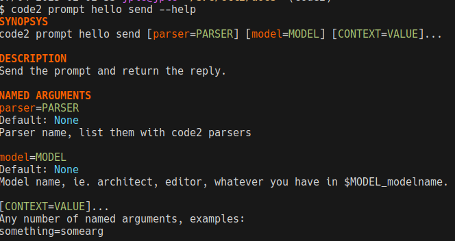

code2: AI assisted CLI
~~~~~~~~~~~~~~~~~~~~~~

Install with ``pip install code2``, and configure LiteLLM by environment
variable. Our default configuration uses free models and requires
``OPENROUTER_API_KEY`` so if you're not familiar with LiteLLM that's probably
what you should start with.

Tutorial
========

Prompt CLI
----------

Let's start by hacking some prompts:

- run ``code2 prompt new hello``
- this will open your ``$EDITOR``, there, type something like ``create a hello
  world in python``
- this created a whole CLI group as you can see by running ``code2 prompt
  hello``.
- run ``code2 prompt hello send``
- you will see the AI responded with a tutorial to create a python script
- run ``code2 prompt hello send wholefile`` to use the wholefile parser with
  that prompt
- you will see that you only get the python source code as output
- run ``code2 prompt hello send wholefile > hello.py``
- you will see that code2 caches responses to save costs, so the second time
  running that command is very fast
- run ``code2 prompt hello edit``, change your text with: ``update this script
  to also print any sys arg with the hello string {{read('hello.py')}}``
- hell yes, we're using jinja2 inside the prompt and telling it to actually
  read the content of the file, you'll be able to register your own jinja
  functions too!
- run ``code2 prompt hello send wholefile > hello.py``
- profit

Troubleshooting
---------------

It's in cli2, so just export DEBUG=1 and beautiful logging is yours.

Models
======

If you have run ``code2 prompt hello send --help`` or something like that, you
might have noticed the model argument:

.. automodule:: code2.model

Python API
==========

You could script like this:

.. code-block:: python

    from code2.model import Model
    from code2.prompt import Prompt

    async def main():
        # get the model defined in $MODEL_ARCHITECT, or $MODEL, or the default
        model = Model.get('architect')

        # having to use project might go away, but that's how you do it for now
        prompt = Prompt('hello')
        result = await model.process(prompt, 'wholefile')

        with open('hello.py', 'w') as f:
            f.write(result)

    import asyncio
    asyncio.run(main())

Or, do exactly that in a WorkflowPlugin class that you can register on the
cli2_workflow entry point, and your plugin will magically appear in the code2
CLI.

Workflows
=========

Alpha level code, api not fully stabilized although we're getting super close.

We provide some workflows by default, but as I'm stabilizing the API they might
not be working.

The ``cmd`` workflow is the one I use get the AI to iterate by itself on test
driven development::

    code2 cmd pytest -vv tests/test_models.py

That workflow will run that command, and if it fails, it orchestrates a few
prompts to get the AI to fix the code. This workflow works great as long as it
provides file paths to fix in the output.

To develop your own workflow, you can inherit from the workflow plugin class.

Plugins
=======

code2 supports 4 types of plugins:

- workflow: those are the commands you see on the main CLI, they orchestrate
  prompts with the objective to optimize the cost/quality final ratio
- parser: those define 2 functions:
    - one allowing to change the messages before sending, such as to add
      something like "reply with a structured list"
    - another to convert the string reply into a python variable, ie. to parse a
      list, file, diff ...
- jinja2: expose your own functions into the jinja2 rendering engine
- backend: you probably won't need that, the default litellm backend works
  great, but if you're using code2 behind an air-gapped network with a custom
  AI API, at least you're able to register another backend

Aider-chat compare
==================

I decided to leave aider-chat and go my own way because:

- It was a bit of a pain to use anything else than litellm, ie. with custom
  APIs in air-gapped networks, when I searched github about plugins, I would
  only find an issue where users wanted to have plugins and someone said it's
  not a priority. Plugins are easy and cool in Python, let's have a lot of
  them!
- Tired of the prompt-toolkit, I like bash and the CLI as it is already.
- Hated the commiting behind my back
- Not a fond of the style, we are themable
- Not to mention the search/replace, I've read their source code since then and
  have found they also support diffs (which my initial poc of this code was
  doing)
- Too much configuration really, environment variables are great, don't we love
  that in 12factor? I like to be able to use different configurations from the
  CLI and only write them in a file when I want to persist them
- In general, I prefer to have my own CLI tools, sure they have their quirks,
  but I live fine with them and they are easy to extend and become dynamic with
  cli2
- Always wanted something that was not completely tied to a project, you can
  work with code2 even without a git project
