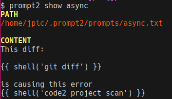

prompt2: AI CLI
~~~~~~~~~~~~~~~

Transform your terminal into an AI powerhouse ⚡ Craft dynamic prompts,
automate workflows, and generate code at lightspeed - all through CLI sorcery
🧙♂️

**THIS THING IS STEALING MY JOB!!**

**Why prompt2?**
================

- 🎮 **Prompt Engineering Playground**: Iterate faster than ChatGPT can say "hallucination"
- 🖥️ **Terminal Native**: Feels like home for vim-wielding keyboard warriors
- ✨ **Jinja2 Turbocharged**: Magic variables like ``{{reads}}``, ``{{writes}}``, and custom filters
- 💸 **Cache Commander**: Automatic response caching slashes API costs by 40%+
- 🔌 **Plugin Ecosystem**: Extend with Python simplicity (backends, parsers, custom filters)

🚀 **Blazing Start**
====================

::

    # litellm pulls a lot of dependencies I don't need in my air-gapped networks
    # as such, you need to pull it manually to use the litellm plugin:
    pip install prompt2 litellm
    export OPENROUTER_API_KEY=sk_...
    prompt2 edit hello
    prompt2 send hello

.. epigraph:: prompt2 is the AI CLI where **YOU** control the narrative.

.. note:: 🔌 LiteLLM pros: Use any supported ENV vars instead of OPENROUTER_API_KEY

🕹️ Tutorial Time!
=================

- run ``prompt2 edit hello``, this will open your ``$EDITOR``, there, type
  something like ``create a hello world in python``. This created a prompt in
  ~/.prompt2/prompts/hello.txt and you can see it with ``prompt2 list``.
- run ``prompt2 send hello``, you will see the AI responded with a tutorial to
  create a python script.
- run ``prompte2 send hello wholefile`` to use the **wholefile parser** with
  that prompt, you will see that you only get the python source code as output
- run ``prompt2 send hello wholefile > hello.py``,  you will see that prompt2
  caches responses to save costs, so the second time running that command is
  very fast
- run ``prompt2 edit hello``, change your text with::

    update this script to also print any sys arg with the hello string {{read('hello.py')}}

  Hell yes, we're using jinja2 inside the prompt and telling it to actually
  read the content of the file, you'll be able to register your own jinja
  functions and template paths too!
- run ``prompt2 send hello wholefile > hello.py``
- profit

**I know prompt-fu**

Troubleshooting
---------------

::

    DEBUG=1 prompt2 send hello  # See the magic behind the curtain

Models
======

.. automodule:: prompt2.model

Python API
==========

Script
------

You could script like this:

.. code-block:: python

    from prompt2 import Model, Prompt

    async def ai_wizard():
        # get the model defined in $MODEL_ARCHITECT, or $MODEL, or the default
        model = Model('architect')

        # load one of your prompts by name
        prompt = Prompt('hello')

        # call the model with the prompt, with a parser by name
        result = await model(prompt, 'wholefile')

        # there you go
        with open('hello.py', 'w') as f:
            f.write(result)

    import asyncio
    asyncio.run(ai_wizard())

Test
----

The pytest plugin was pretty easy to write, given that prompt2 already does
response caching. Just add the ``prompt2_env`` fixture in your pytest script
and it will:

- store the cache in your repo instead of home dir, so that it can find it
  again
- store prompts in temporary directories, so that you can mess with them

Plugins
=======

prompt2 supports a bunch of plugin types, all registered by Python's standard
entry points.

- **parser**: those define 2 functions:
    - one allowing to change the messages before sending, such as to add
      something like "reply with a structured list"
    - another to convert the string reply into a python variable, ie. to parse a
      list, file, diff ...
- **jinja2**: register custom functions to have in your templates
- **backend**: custom APIS backend: you probably won't need that, the default
  litellm backend works great, but if you're using prompt2 behind an air-gapped
  network with a custom AI API, at least you're able to register another
  backend.

Jinja functions
===============

.. automodule:: prompt2.jinja2
   :members:

CLI Reference
=============

.. cli2:auto:: prompt2

Why I Built prompt2 Instead of Sticking with aider-chat
=======================================================

Let's face it: someone is going to wonder. When I first explored aider-chat, I
saw its potential, but over time, I found it didn’t align with my workflow or
goals. Here’s why I decided to forge my own path with prompt2:

- **Flexibility with APIs**: aider-chat leaned heavily on litellm, which made
  it tricky to integrate custom APIs—especially in air-gapped networks. I
  searched GitHub for plugin support and found an issue where users requested
  it, only to be told it wasn’t a priority. Plugins are a simple, powerful
  feature in Python, and I wanted a tool that embraces them fully.

- **CLI Over Prompt Toolkits**: I grew tired of prompt-toolkit. I’m a fan of
  bash and the classic CLI experience—why reinvent something that already works
  well?

- **Control Over Commits**: I didn’t like how aider-chat committed changes
  behind my back. I prefer to stay in charge of my version control flow.

- **Customizable Style**: The fixed style of aider-chat wasn’t my taste. With
  :py:mod:`cli2.theme`, I’ve made theming a core feature—because who doesn’t
  love a tool that looks the way they want? Heck, you can even ``import
  prompt2`` and do your python-click CLI if you really dislike cli2.

- **Light Configuration**: aider-chat relied on heavy configuration, which felt
  overkill. I love environment variables (hello, 12-factor apps!), but I also
  want the freedom to tweak settings from the CLI and only save them to a file
  when I choose to, in ``export VAR=`` format.

- **Owning My Tools**: I’ve always preferred building my own CLI tools. Sure, they
  have quirks, but they’re mine. With cli2, extending and adapting them is a
  breeze, and I can make them as dynamic as I need.

- **Project Independence**: I wanted a tool that wasn’t tied to a specific git
  project. prompt2 lets you work with code anywhere, whether it’s part of a
  repository or not.

In short, prompt2 is my take on a lightweight, flexible, and CLI-driven
alternative. It’s built for people like me who value simplicity, control, and
the ability to make a tool their own. If that resonates with you, give it a
try!
