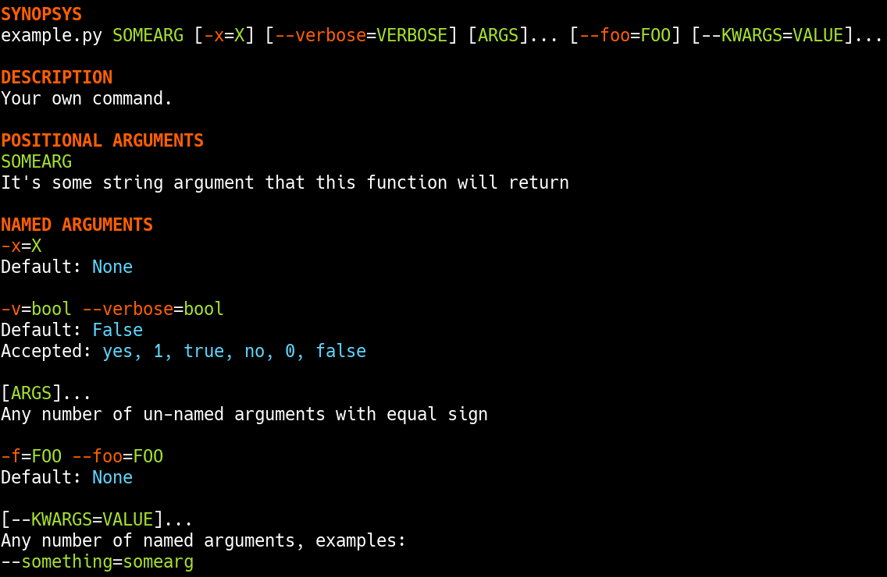
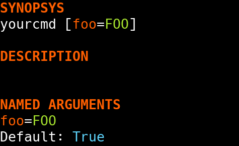

Tutorial for cli2: Dynamic CLI for Python 3
~~~~~~~~~~~~~~~~~~~~~~~~~~~~~~~~~~~~~~~~~~~

Architecture
============

Overview
--------

cli2 is built on 3 moving parts which you can swap with your own or inherit
from with ease:

- :py:class:`~cli2.command.Command`: Represents a target callback, in charge
  of CLI args parsing and execution, can serve as entry point.
- :py:class:`~cli2.group.Group`: Same as above, except that it routes multiple
  Commands, can serve as entry point as well.
- :py:class:`~cli2.argument.Argument`: Represents a target callback argument,
  in charge of deciding if it wants to take an argument as well as casting it
  into a Python value.

You probably won't care about the latter even for custom use cases.

Command
=======

Create a command from any callable:

.. code-block:: python

    import cli2

    def yourcmd(somearg: str):
        """
        Your own command.

        :param somearg: It's some string argument that this function will return
        """
        return somearg

    # this if is not necessary, but prevents CLI execution when the module is
    # only imported
    if __name__ == '__main__':
        cli2.Command(yourcmd).entry_point()

Running the script without argument will show the generated help:

Complex signature
-----------------

The same function with a rich signature like this:

.. code-block:: python

    def yourcmd(somearg, x=None, verbose : bool = False, *args, foo=None, **kwargs):

Will display help as such:

Posix style
-----------

You might prefer to have dashes in front of argument names in the typical style
of command lines, you just need to enable the posix attribute:

.. code-block:: python

    cli2.Command(yourcmd, posix=True).entry_point()

In this case, help will look like this:

Testing
-------

The :py:meth:`~cli2.command.Command.parse` method will provision the
:py:attr:`~cli2.command.Command.bound` attribute which is a Python 3
BoundArguments instance, so you could test parsing as such:

.. code-block:: python

    cmd = cli2.Command(yourcmd)
    cmd.parse('a', 'b', 'c=d')
    assert cmd.bound.arguments == dict(somearg='a', x='b', kwargs={'c': 'd'})

Same if you want to use the posix style:

.. code-block:: python

    cmd = cli2.Command(yourcmd, posix=True)
    cmd.parse('a', 'b', '--c=d')
    assert cmd.bound.arguments == dict(somearg='a', x='b', kwargs={'c': 'd'})

Entry point
-----------

Another possibility is to add an entry point to your setup.py as such:

.. code-block:: python

    entry_points={
        'console_scripts': [
            'yourcmd = yourcmd:cli.entry_point',
        ],
    },

Then, declare the command in a ``cli`` variable in ``yourcmd.py``:

.. code-block:: python

    # if __name__ == '__main__':  if block not required in entry point
    cli = cli2.Command(yourcmd)

Command overridding
-------------------

Overriding the Command class can be useful to override how the target callable
will be invoked. Example:

.. code-block:: python

    class YourThingCommand(cli2.Command):
        def call(self):
            # do something
            return self.target(*self.bound.args, **self.bound.kwargs)

    @cli2.cmd(cls=YourThingCommand)
    def yourthing():
        pass

    cmd = Command(yourthing)  # will be a YourThingCommand

Group
=====

:py:class:`~cli2.group.Group` can be used in place of
:py:class:`~cli2.argument.Command`, and new commands can be added into it.

Decorator syntax
----------------

Example using :py:meth:`~cli2.group.Group.cmd`:

.. code-block:: python

    """My command docstring"""
    import cli2

    cli = cli2.Group(doc=__doc__)

    @cli.cmd
    def yourcmd():
        """Your command"""

    @cli.cmd(color='red')
    def dangerzone(something):
        """A dangerous command"""

    if __name__ == '__main__':
        cli.entry_point()

As you can see, the decorator may be called with or without arguments, any
argument that are passed would override the default attributes from the
generated :py:class:`~cli2.argument.Command`. Running this script without
argument will show:

Python API
----------

Equivalent example using :py:meth:`~cli2.group.Group.add`:

.. code-block:: python

    import cli2

    def yourcmd():
        """Your command"""

    def dangerzone(something):
        """A dangerous command"""

    if __name__ == '__main__':
        cli = cli2.Group()
        cli.add(yourcmd)
        cli.add(dangerzone, color='red')
        cli.entry_point()

Lazy loading: overriding Group
------------------------------

Equivalent example, but built during runtime, having the arguments at disposal:

.. code-block:: python

    import cli2

    def yourcmd():
        """Your command"""

    def dangerzone(something):
        """A dangerous command"""

    class Cli(cli2.Group):
        def __call__(self, *argv):
            # you could use the *argv variable here
            self.add(yourcmd)
            self.add(dangerzone, color='red')
            return super().__call__(*argv)

    if __name__ == '__main__':
        Cli().entry_point()

This is the same as the other command group examples above, but here the Group
is built during runtime.

See the source code for the ``cli2`` command, which implements an infitely lazy
loaded command tree based on introspection of the passed arguments with
extremely little code.

Lazy loading: using Group.load
------------------------------

You could also load commands more massively with the
:py:meth:`~cli2.group.Group.load` method which will load any callable given as
Python object or as dotted python path, all the following work:

.. code-block:: python

    group = cli2.Group()
    group.load(YourClass)
    group.load(your_object)
    group.load('your_module')
    group.load('your_module.your_object')

Argument
========

Aliases
-------

By default, named arguments are given aliases (CLI argument names) generated
from their Python argument names. For example:

.. code-block:: python

    def yourcmd(foo=True):
        print(foo)
    cmd = cli2.Command(yourcmd)
    cmd.help()

Will render help as such:

Posix
-----

If posix mode is enabled, then a couple of dashes will prefix the Python
argument name, and another one-letter-long alias with a single dash will be
generated.

.. image:: example_alias_posix.png

Overrides
---------

You may overrides :py:class:`~cli2.argument.Argument` attributes for a callable
argument with the :py:func:`~cli2.decorators.arg` decorator:

.. code-block:: python

    @cli2.arg('foo', alias='bar')
    def yourcmd(foo):
        pass

This also takes a list of aliases:

.. code-block:: python

    @cli2.arg('foo', alias=['foo', 'f', 'foooo'])
    def yourcmd(foo):
        pass

This decorator basically sets ``yourcmd.cli2_foo`` to a dict with the alias
key.

Integers
--------

Type hinting is well supported, the following example enforces conversion of an
integer argument:

.. code-block:: python

    def yourcmd(i : int):
        pass

    cmd = cli2.Command(yourcmd)
    cmd.parse('1')
    assert cmd.bound.arguments == dict(i=1)

Boolean
-------

Declare a boolean type hint for an argument as such:

.. code-block:: python

    def yourcmd(yourbool : bool):

You won't have to specify the value of a boolean argument, but if you want to
then:

- for ``False``: no, 0, false
- for ``True``: yes, 1, true, anything else

Values don't need to be specified, which means that you don't have to type
``yourbool=true``, just ``yourbool`` or ``--yourbool`` in POSIX mode will set
it to True.

Since the mere presence of argument aliases suffice to bind a parameter to
True, an equivalent is also possible to bind it to False:
:py:attr:`~cli2.argument.Argument.negate`. It is by default generated by
prefixing ``no-`` to the argument name, as such, passing ``no-yourbool`` on the
command line will bind ``yourbool`` to ``False``, or in posix mode by passing
``--no-yourbool``. Note that a single-dash two-letter negate is also generated
in posix mode, so ``-ny`` would also work to bind ``yourbool`` to ``False``.

False
-----

While the negates are set by default on boolean arguments, you may also set it
on non-boolean arguments, just like you could override it like you would
override aliases:

.. code-block:: python

    @cli2.arg('yourbool', negate='--no-bool')
    def yourcmd(yourbool):

List and Dicts
--------------

Arguments annotated as list or dict will have CLI values automatically casted
to Python using JSON.

.. code-block:: python

    def yourcmd(foo: list):
        print(foo)

But be careful with spaces on your
command line: one sysarg goes to one argument::

    yourcmd ["a","b"]   # works
    yourcmd ["a", "b"]  # does not because of the space

However, space is supported as long as in the same sysarg:

.. code-block:: python

    subprocess.check_call(['yourcmd', '["a", "b"]')

Typable lists and dicts
-----------------------

So, the above will work great when called by another program, but not really
nice to type. So, another syntax for the purpose of typing is available and
works as follow.

Arguments with the list type annotation are automatically parsed as JSON, if
that fails it will try to split by commas which is easier to type than JSON for
lists of strings::

    yourcmd a,b  # calls yourcmd(["a", "b"])

Keep in mind that JSON is tried first for list arguments, so a list of ints is
also easy::

    yourcmd [1,2]  # calls yourcmd([1, 2])

A simple syntax is also supported for dicts by default::

    yourcmd a:b,c:d  # calls yourcmd({"a": "b", "c": "d"})

The disadvantage is that JSON decode exceptions are swallowed, but by design
cli2 is supposed to make Python types more accessible on the CLI, rather than
being a JSON validation tool. Generated JSON args should always work though.

Custom type casting
-------------------

You may also hack how arguments are casted into python values at a per argument
level, using decorator syntax or the lower level Python API.

For example, you can override the :py:meth:`~cli2.argument.Argument.cast()`
method for a given argument as such:

.. code-block:: python

    @cli2.args('ages', cast=lambda v: [int(i) for i in v.split(',')])
    def yourcmd(ages):
        return ages

    cmd = Command(yourcmd)
    cmd(['1,2']) == [1, 2]  # same as CLI: yourcmd 1,2

You can also easily write an automated test:

.. code-block:: python

    cmd = cli2.Command(yourcmd)
    cmd.parse('1,2')
    assert cmd.bound.arguments == dict(ages=[1, 2])

Argument overriding
-------------------

Overriding an Argument class can be useful if you want to heavily customize an
argument, here's an example with the age argument again:

.. code-block:: python

    class AgesArgument(cli2.Argument):
        def cast(self, value):
            # logic to convert the ages argument from the command line to
            # python goes in this method
            return [int(i) for i in value.split(',')]

    @cli2.arg('ages', cls=AgesArgument)
    def yourcmd(ages):
        return ages

    assert yourcmd('1,2') == [1, 2]

Edge cases
==========

Simple and common use cases were favored over rarer use cases by design. Know
the couple of gotchas and you'll be fine.

Args containing ``=`` when ``**kwargs`` is present
--------------------------------------------------

Simple use cases are favored over rarer ones when a callable has varkwargs.

When a callable has ``**kwargs`` as such:

.. code-block:: python

    def foo(x, **kwargs):
        pass

Then, arguments that look like kwargs will be attracted to the kwargs
argument, so if you want to call ``foo("a=b")`` then you need to call as such::

    foo x=a=b

Because the following will call ``foo(a='b')``, and fail because of missing
``x``, which is more often than not what you want on the command line::

    foo a=b

Now, even more of an edgy case when ``*args, **kwargs`` are used:

.. code-block:: python

    def foo(*args, **kwargs):
        return (args, kwargs)

Call ``foo("a", b="x")`` on the CLI as such::

    foo a b=x

**BUT**, to call ``foo("a", "b=x")`` on the CLI you will need to use an
asterisk with a JSON list as such::

    foo '*["a","b=x"]'

Admittedly, the second use case should be pretty rare compared to the first
one, so that's why the first one is favored.

For the sake of consistency, varkwarg can also be specified with a double
asterisk and a JSON dict as such::

    # call foo("a", b="x")
    foo a **{"b":"x"}

Calling with ``a="b=x"`` in ``(a=None, b=None)``
------------------------------------------------

The main weakness is that it's difficult to tell the difference between a
keyword argument, and a keyword argument passed positionnaly which value starts
with the name of another keyword argument. Example:

.. code-block:: python

    def foo(a=None, b=None):
        return (a, b)

Call ``foo(b='x')`` on the CLI like this::

    foo b=x

**BUT**, to call ``foo(a="b=x")`` on the CLI, you need to name the argument::

    foo a=b=x

Admitadly, that's a silly edge case. Protect yourself from it by always naming
keyword arguments ...

... Because the parser considers token that start with a keyword of a keyword
argument prioritary to positional arguments once the positional arguments have
all been bound.
